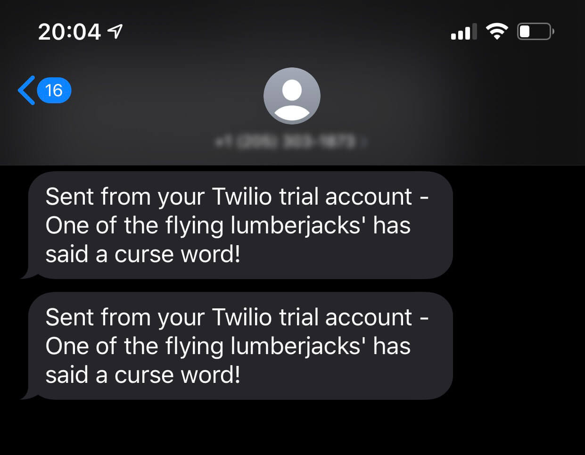

# Durable Function - Instrumenting

[What are Durable Functions?](https://docs.microsoft.com/en-us/azure/azure-functions/durable/durable-functions-overview?tabs=csharp) Microsoft's definition of Durable Functions is:

> Durable Functions is an extension of [Azure Functions](https://docs.microsoft.com/en-us/azure/azure-functions/functions-overview) that lets you write stateful functions in a serverless compute environment. The extension enables you to define stateful workflows by writing [orchestrator functions](https://docs.microsoft.com/en-us/azure/azure-functions/durable/durable-functions-orchestrations) and stateful entities by writing [entity functions](https://docs.microsoft.com/en-us/azure/azure-functions/durable/durable-functions-entities) using the Azure Functions programming model. Behind the scenes, the extension manages state, checkpoints, and restarts for you, allowing you to focus on your business logic.

This code was initially written as my solution to [Day 23](https://25daysofserverless.com/calendar/23) of [#25DaysOfServerless](https://25daysofserverless.com) in December 2019.

## Quick Deploy to Azure

### Configuration
The solution uses the Twilio Connector available in Azure Logic Apps. The following information will be required from [Twilio](https://www.twilio.com/)
* Your Twilio account ID (twilioSid parameter) [authentication token](https://support.twilio.com/hc/en-us/articles/223136027-Auth-Tokens-and-How-to-Change-Them) (twilioToken parameter), which you can find on your Twilio dashboard
Your credentials authorize your logic app to create a connection and access your Twilio account from your logic app. If you're using a Twilio trial account, you can send SMS only to verified phone numbers.
* A verified Twilio phone number that can send SMS
* A verified Twilio phone number that can receive SMS

### Deploy
The resources can be deployed using the following button.

[](https://azuredeploy.net/)

Once the resources are created, the Function code and be deployed and tested thoroughly. There are many ways in which the Function could be deployed, but one way is via [Visual Studio Code](https://code.visualstudio.com) and the [Azure Functions Azure Functions extension](https://docs.microsoft.com/en-us/azure/azure-functions/functions-develop-vs-code?tabs=csharp#install-the-azure-functions-extension).

Alerts may be triggered until the Function has been deployed.

## The Challenge


Ages ago, workers of a remote timber camp in Quebec wanted to meet their wives for the night of Christmas. The problem was that they needed to work the next day, and their homes were hundreds of leagues away. They made a pact with the devil to run the Chasse-Galerie so that their canoe could fly through the air.

A flying canoe would surely allow them to get home and back before the night was over! However, as part of the deal, the workers are not allowed to curse, or their soul would be claimed by the devil.

On their trip to their home, and back, we need to make sure that their canoe is still operational. Their worried wives will be monitoring if everything is okay. They will need to receive an alert if something happens.

For this scenario, the canoe will need a Health Check endpoint that will return a ```200``` if everything is okay or throw an exception if a worker has cursed on their voyage. The worker curses 10% of the time.

After that endpoint is up and running, you'll need to build something that can notify the flying lumberjacks' wives if things have gone horribly wrong. One choice might be to use Azure Application Insights.

## Solution

### Azure Functions

For the challenge, a Health Check endpoint was needed for the canoe that will return a ```200``` HTTP status code if everything is okay or throw an exception (```400```) if a worker has cursed on their voyage. The worker curses 10% of the time. So, if for example, the endpoint was checked ten times, one of those ten times should return an error. [Entity functions](https://docs.microsoft.com/en-us/azure/azure-functions/durable/durable-functions-entities) made this easy as the count from one through to ten could be kept in 'state' along with a randomised number to decide when the error would be returned.

### Application Insights

There is a Function acting as the Health Check endpoint for the canoe, so it now needs monitoring. In [Azure Application Insights](https://docs.microsoft.com/azure/azure-functions/functions-monitoring?WT.mc_id=25daysofserverless-github-cxa) it allows you to [Monitor the availability of any website](https://docs.microsoft.com/en-us/azure/azure-monitor/app/monitor-web-app-availability). In this instance, it was necessary to keep checking the endpoint at a given frequency, and so a [URL ping test](https://docs.microsoft.com/en-us/azure/azure-monitor/app/monitor-web-app-availability#create-a-url-ping-test) was chosen. It uses more advanced HTTP request functionality to validate whether an endpoint is responding, or in this instance, occurrences of a ```400``` HTTP status code.


Staying within Application Insights, once it was known when a worker had cursed, it needed alerting on. Availability tests form part of [Availability alerts](https://docs.microsoft.com/en-us/azure/azure-monitor/app/availability-alerts). Thus, the alert was configured to alert when the count is one and for the action group to trigger a Logic App.


### Logic App

[Azure Logic Apps](https://docs.microsoft.com/en-us/azure/logic-apps/logic-apps-overview) is a cloud service that helps you schedule, automate, and orchestrate tasks, business processes, and workflows when you need to integrate apps.

The Logic App allows the automation of an alert from the Function to the wives of the flying lumberjacks'. The Function App is polled, Application Insights raises the alert and the Logic App, through an [HTTP Trigger endpoint](https://docs.microsoft.com/en-us/azure/logic-apps/logic-apps-http-endpoint), sends an automated message.

For the automated message, an SMS message was chosen. Logic App's allow for easy integration with [Twilio](https://www.twilio.com) through an easy to use [Twilio connector](https://docs.microsoft.com/en-us/azure/connectors/connectors-create-api-twilio).


In the above screenshot, a condition can be seen. It's important to [Understand how metric alerts work in Azure Monitor](https://docs.microsoft.com/en-us/azure/azure-monitor/platform/alerts-metric-overview). The Logic App contains a condition based on the status received in the HTTP request from the alert rule. The alert rule monitors the condition for two more times, to send out a resolved notification. The alert rule sends out a resolved/deactivated message when the alert condition is not met for three consecutive periods to reduce noise in case of flapping conditions. To only alert when the alert rule is activated, the condition is required.

## Results

The Function plays an important part, but there is not much to see other than the response containing details about where the count is and at what point a worker cursing will be simulated. An example response is:

```json
{
    "entityExists": true,
    "entityState": {
        "counter": 7,
        "workerCursesAt": 5,
        "health": 1
    }
}
```

Within ```Availability``` blade of Application Insights, the results of the Availability Test can be seen. A sample of the results is shown below. Remember that in this test, as a code of ```400``` is being tested for. As such,  the 'Successful' results are what will be alerted on.


Once the Availability Alert has been triggered, it is possible to see the Logic App being triggered as well:


Which, results in SMS texts being received by the wives.


